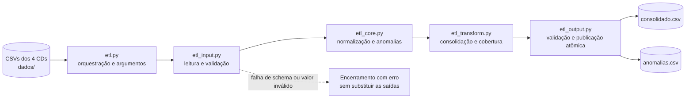

# ETL de consolidação de estoque

Solução para consolidar os estoques de Campinas, Belo Horizonte, São Caetano e
Londrina. O processo lê as exportações CSV do WMS, valida e normaliza os registros,
consolida os saldos por produto e publica relatórios de estoque e anomalias.

## Fluxo do ETL



O `etl.py` é o ponto de entrada e a fachada pública. Cada módulo mantém uma etapa
do processamento isolada, e as saídas somente substituem as versões anteriores
depois de serem escritas e validadas com sucesso.

## Como executar

Na raiz do projeto, com Python 3.11 ou superior instalado:

```powershell
python sua-entrega/src/etl.py
```

O comando lê os quatro arquivos em `dados/` e recria
`sua-entrega/consolidado.csv` e `sua-entrega/anomalias.csv`. Não há dependências
externas.

Para usar outros diretórios ou outra data de referência:

```powershell
python sua-entrega/src/etl.py --input dados --output sua-entrega --reference-date 2026-08-20
```

O processo valida schema, números, datas, códigos e consistência das vendas. Em
caso de erro, encerra com código diferente de zero e não publica conteúdo
parcialmente processado.

## Testes

```powershell
python -m unittest discover -s sua-entrega/tests -v
```

A suíte cobre parsing brasileiro, datas, códigos, duplicidade, descrição
canônica, consolidação, cobertura e falhas de entrada, além de validar os totais
dos arquivos reais. A descrição de cada cenário está em
[`sua-entrega/tests/TESTES.md`](sua-entrega/tests/TESTES.md).

## Regras principais

- `saldo` e `vendas_mes_ant` são unidades inteiras; o `,00` da origem é apenas formatação.
- Códigos curtos recebem zeros à esquerda, mas o valor original permanece no relatório de anomalias.
- Duplicatas idênticas são removidas antes da soma.
- `vendas_mes_ant` é somada uma vez por produto e CD, não uma vez por lote.
- Saldos negativos são preservados e sinalizados para investigação no WMS; o ETL não presume sua causa.
- O saldo disponível inclui somente lotes identificados e não vencidos. Estoque vencido ou com validade não verificável permanece visível em colunas próprias.
- Os vencimentos são separados nas faixas de até 7, 8–30, 31–60 e 61–90 dias.
- A cobertura é arredondada para duas casas e fica vazia quando a venda total é zero.

## Estrutura

```text
.
├── dados/                  # exportações dos quatro centros de distribuição
├── sua-entrega/
│   ├── src/                # módulos do ETL
│   ├── tests/              # testes automatizados e sua documentação
│   ├── consolidado.csv     # visão consolidada por produto
│   ├── anomalias.csv       # inconsistências técnicas e operacionais
│   ├── DECISOES.md         # perguntas, premissas e decisões da entrega
│   ├── ETL.md              # documentação detalhada do processamento
│   └── REVISAO.md          # revisão do script de integração WMS
└── README.md
```

Para os detalhes das validações, transformações e campos gerados, consulte
[`sua-entrega/ETL.md`](sua-entrega/ETL.md).
